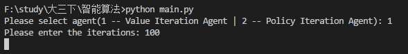
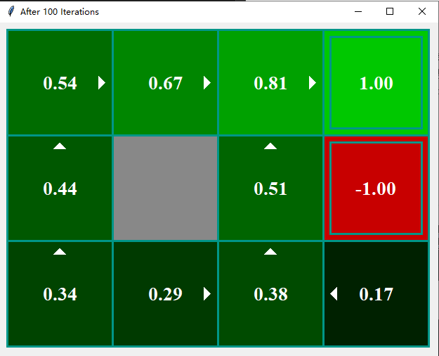
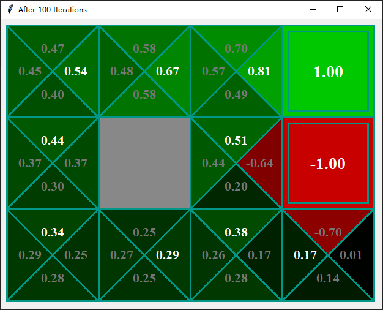

# MDP

## 环境说明

利用Python3.6开发，需要tkinter显示UI。

## 文件说明

- main.py: 主文件，进行输入和输出。
- UI.py: 包含输出页面必要的函数。
- agent.py: 实现了`MDP`类（基本模型）、`IterationAgent`类（VI和PI的公共接口类）、`ValueIteraionAgent`类（实现值迭代算法）、`PolicyIterationAgent`类（实现策略迭代算法）。

## 输入

运行main.py后在控制台中选择agent类型以及输入迭代次数。

## 输出

默认输出最后一次迭代的 Value 值和策略：

按回车键可切换到 Qvalue 值，字体颜色为白表示策略选择的动作：

