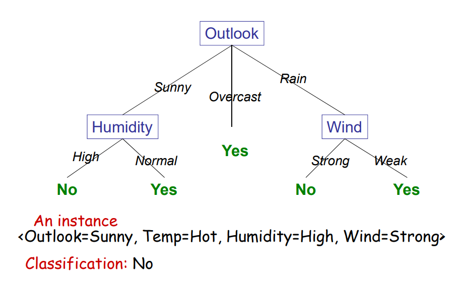

# Decision Tree Learning

## 1. Definition

决策树本质就是一个boolean函数，通过接受输入返回一个bool值。通常训练集并没有覆盖所有的情况（如果覆盖了所有的情况就是一张完整的真值表了）。

决策树的节点是属性，边是属性值，叶子节点是输出值。



<p style="text-align: center; font-style: italic">An Example</p>

## 2. Algorithm

**Aim**：找到一个小的决策树包含所有的训练样例。

**Idea**：每次选择最重要的属性作为根。


```
function DecisionTreeLearning(examples, attrbutes, parent_examples) return a tree
    if examples is empty then return Plurality-Value(parent_examples)
    else if all examples have the same classification then return the classification
    else if attrbutes is empty then return 
```
