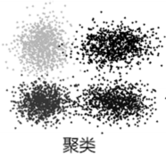
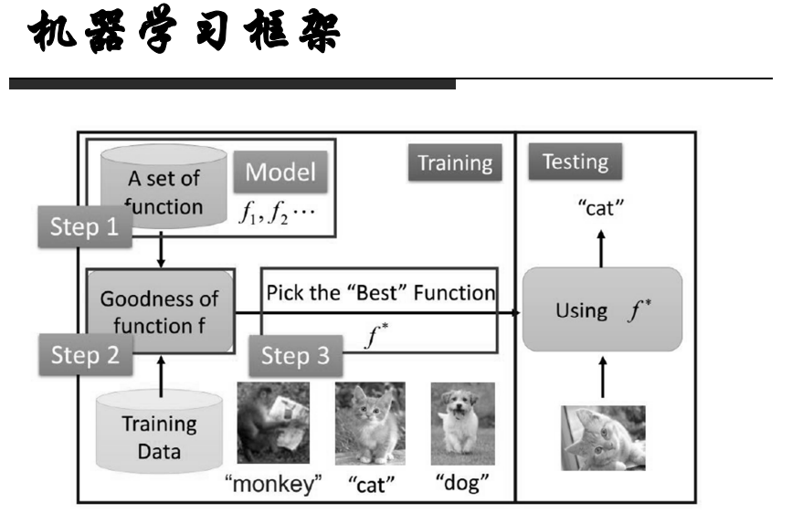
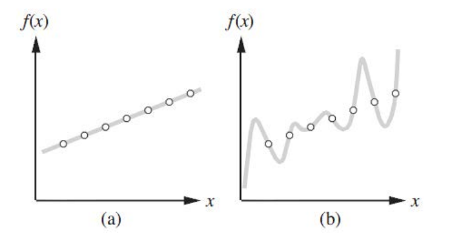

# Machine Learning

## What is Machine Learing

> A computer program is said to learn from experience E with respect to some class of tasks T and performance measure P, if its performance at tasks in T, as measured by P, improves with experience E. ——Mitchell

机器学习目标是在有一些先验知识或者说经验（E）的前提下完成一些任务（T），完成的效果有一个量化的衡量方法（P）。机器学习通常分为以下几类：

- 有监督学习（supervised learning）：如果所有训练数据都有标签，则为有监督学习。这样当有特征而无标签的数据输入时，就可以通过已有的关系得到未知数据标签。
- 无监督学习（unsupervised learning）：如果数据没有标签，就是无监督学习，也即聚类(clustering)。

- 半监督学习（semi-supervised learning）：聚类数据集中包含有标签的数据。
- 强化学习（Reinforcement learning）：AlphaGo背后的机器学习原理。

一个机器学习框架：

## Supervised learning

### Definition

给定一组包含N个样例的训练集，即元组(x1,y1),(x2,y2),...,(xn,yn)，其中yj时由未知函数`y=f(x)`生成的，有监督学习的任务时找到一个函数h能够近似未知函数f，h是假设（hypothesis），它时假设空间（Hypothesis space）中的一个元素。

### learning Tasks

通常来讲学习任务分为两种：

- **分类（classification）**：将数据映射到定义好的群组或类，类的个数时确定的、预先定义好的（即输出时离散值），从数据中已经分好类的训练集，在训练集上建立分类模型，对未分类的数据进行分类。
- **回归（regression）**：将数据映射到一个连续值，建立回归模型拟合输入数据。

### Ockham's razor

如下图的数据，进行回归，可以用线性模型拟合，也可以用非线性模型拟合：

我们通常认为(a)中的模型比(b)中的模型好，因为它比较简答，也即是我们通常更倾向于从假设空间中选择最简单的假设，这就是**奥卡姆剃刀（Ockham's razor）原则**。

### Realizability

当假设空间中包含真值函数f，我们说一个学习问题是可实现的。但我们并不总是能知道一个给定问题是否是可实现的，因为f并不知道。

需要注意的是，我们的假设空间不能太大，比如**所有的java程序**或者**所有的图灵机**这种假设空间，尽管他们一定包含真值函数f，但找到f的复杂度是很大的。如果我们的假设空间设置为线性空间是比较简单的，设置为高维多项式空间时困难的，设置为所有图灵机时不可预知的。

## Algorithms

### Classification

- [Decision Tree](Algorithm/DecisionTree.md)